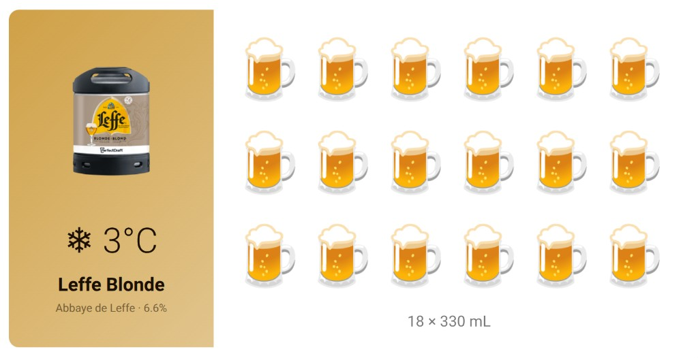

# PerfectDraft Pro for Home Assistant

A Home Assistant custom integration for the [PerfectDraft Pro](https://www.perfectdraft.com/) beer dispenser. Monitor your keg's temperature, remaining volume, pour history, and more — right from your HA dashboard.

## Sensors

| Sensor | Description | Unit |
|--------|-------------|------|
| Temperature | Current beer temperature | °C |
| Keg Remaining | Beer left in the keg | % |
| Keg Freshness | Days remaining until 30-day freshness expires | days |
| Connection | Machine connectivity status | — |
| Door | Door open/closed state | — |
| Pours | Number of pours since keg was loaded | — |
| Last Pour | Volume of the most recent pour | mL |
| Mode | Current operating mode (standard, eco, etc.) | — |
| Firmware | Machine firmware version (disabled by default) | — |

## Installation

### Via HACS (recommended)

1. Open HACS in Home Assistant
2. Click the three-dot menu > **Custom repositories**
3. Add this repository URL and select **Integration** as the category
4. Search for "PerfectDraft" and install
5. Restart Home Assistant

### Manual

1. Copy the `custom_components/perfectdraft` folder to your HA `config/custom_components/` directory
2. Restart Home Assistant

## Setup

### Step 1: Credentials

Go to **Settings > Devices & Services > Add Integration > PerfectDraft** and enter your PerfectDraft app email and password.

### Step 2: Verification Token

The integration needs a one-time verification token from PerfectDraft's website. This step looks more technical than it actually is — it takes about 30 seconds:

1. Open [perfectdraft.com/en-gb/customer/account/login](https://www.perfectdraft.com/en-gb/customer/account/login) in your browser (Chrome, Firefox, Edge, etc.) — you do **not** need to log in on this page, just open it
2. Press **F12** to open Developer Tools, then click the **Console** tab
3. Paste this command and press **Enter**:

```javascript
grecaptcha.enterprise.execute('6LcZQiUoAAAAAAO3JUjLiT470c-pNXbWyepuvMtV', {action: 'Magento/login'}).then(t => console.log(t))
```

4. A long string of text will appear in the console — that's your token
5. Select it, copy it, and paste it into the Home Assistant setup dialog
6. Click **Submit** within 2 minutes (the token expires)

That's it! The integration will authenticate and start polling your PerfectDraft Pro. Token refresh is automatic — you should not need to repeat this step. If the session does eventually expire, Home Assistant will prompt you to re-authenticate. (This is a new integration, so the exact session lifespan is still being determined — it's at least 30 days and may well be indefinite.)

### Step 3: Configure polling

After setup, you can adjust the polling interval in the integration's options. Default is 15 minutes; minimum is 1 minute.

## Companion Card

The [PerfectDraft Card](https://github.com/Falkvinge/hassio-component-perfectdraft-pro) is a custom Lovelace card that visualises your keg data as a beer emoji pictogram — see at a glance what's on tap, how cold it is, and how many glasses remain. Designed for wall-mounted panels (Sonoff NSPanel Pro), works on any HA dashboard.



Install via HACS (Dashboard category) or see the [card repository](https://github.com/Falkvinge/hassio-component-perfectdraft-pro) for details.

## How It Works

The integration communicates with PerfectDraft's cloud API to read your machine's telemetry data. Token refresh is handled automatically via AWS Cognito — no reCAPTCHA needed after the initial setup.

For the full technical story of how this integration was reverse-engineered, see [DISCOVERY.md](DISCOVERY.md).
